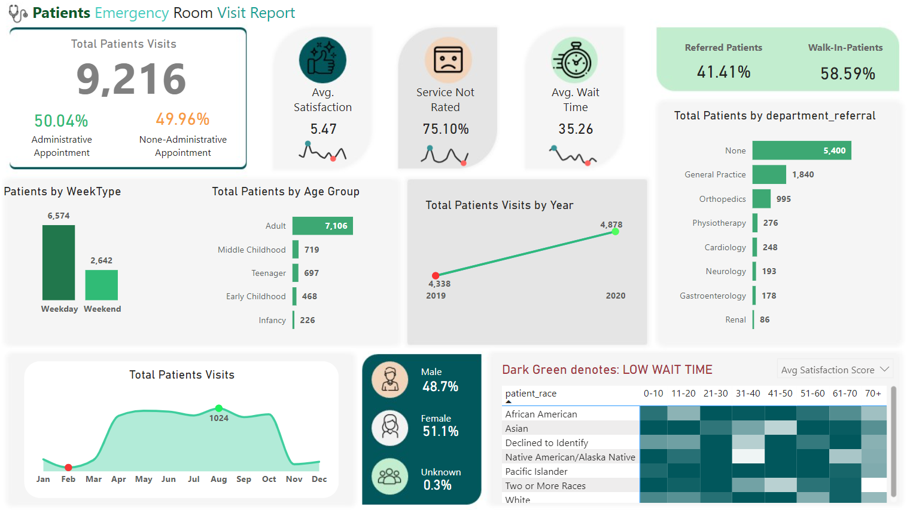

# Hospital - Clinics Report

**Overview**
This project aims to provide a comprehensive dashboard for visualizing patient data, helping healthcare professionals and administrators gain insights into various aspects of patient demographics, satisfaction, administrative status, and departmental efficiency. By leveraging this dashboard, users can make data-driven decisions to improve patient care and operational efficiency.

**Features**

**1. Average Wait Time:** Discover how long patients typically wait before their appointments. Uncover patterns and trends that shed light on the efficiency of our healthcare system.

**2. Patient Satisfaction:** We'll explore the average satisfaction scores given by our patients. Learn about the factors that contribute to a positive patient experience and how we can enhance it.

**3. Total Patient Visits Monthly:** Get an overview of the ebb and flow of patients through our doors each month. Understand the dynamics of healthcare demand over time.

**4. Administrative vs. Non-Administrative Appointments:** Delve into the data to distinguish between appointments that involve administrative processes and those that don't. Explore the impact on wait times and patient satisfaction.

**5. Referrals and Walk-In Patients:** Uncover the balance between patients referred to specific departments and those who walk in without prior referral. How does this impact the overall patient experience?

**6. Patient Visits by Age Group and Race:** Explore the distribution of patient visits across different age groups and races. Gain insights into the diversity of healthcare needs and preferences.